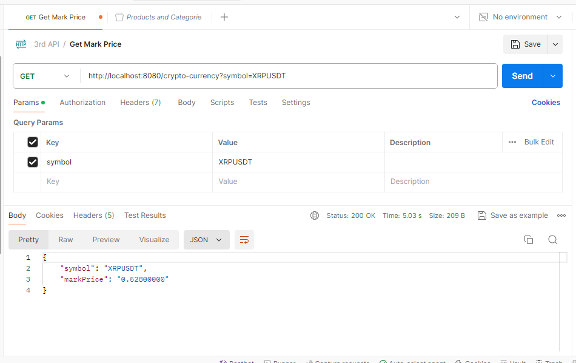

# CRYPTO-CURRENCY-CONTROLLER

Java-based application providing mark price for cryptocurrency pair from binance.com.

## Controllers Functionality

## Set Up Instructions

Firstly, for successfully running application, ensure you have installed on your PC JDK 17, Maven 
and Postman (optionaly).

Clone the repository:

`git clone git@github.com:oksana-rudenko/crypto-currency-controller.git`

Build the project:

`mvn clean package`

Run the project.

Use url for trying controller:

[http://localhost:8080/crypto-currency?symbol=btcusdt](http://localhost:8080/crypto-currency?symbol=btcusdt)

where instead of "btcusdt" use any other cryptocurrency.

Try end-points by using Postman (or Swagger).

## Working with Postman

Example of trying project with Postman.

##  Technologies

1. [x] JDK 17
2. [x] Spring Boot v.3.1.4
3. [x] Spring Boot Web 3.1.4
4. [x] Lombok 0.2.0
5. [x] Maven 3.6.3
6. [x] Postman
7. [x] Mockito
8. [x] Jackson